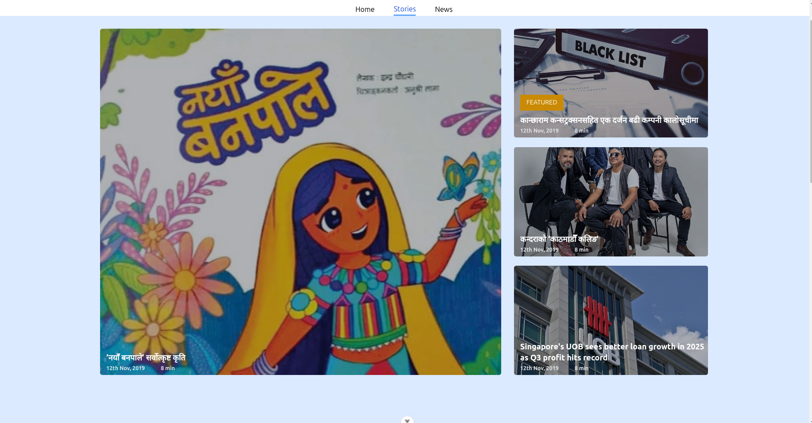
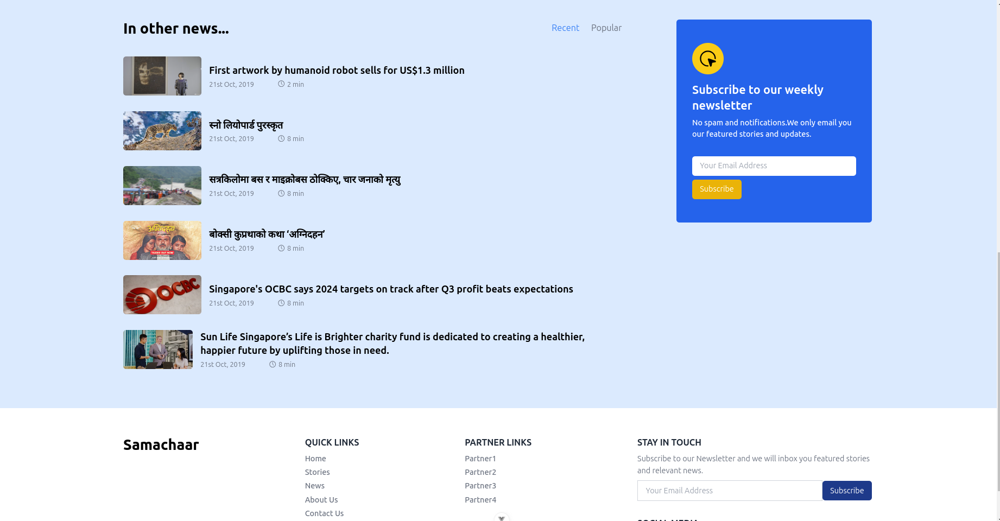

# samachaar. Catchup with the news

Read recent news articles in Nepal.

- Latest news articles.
- Latest stories from Nepal.

## Preview





## 🏗 Development Guide

### 1. clone the repository

```sh
git clone https://github.com/rahulrajdahal/samachaar.git
```

### 2. Install Dependencies

#### npm

```sh
cd samachaar && npm install
```

### 3. Run development server

```sh
npm run dev
```

#### OR

### Run Production server

```sh
npm run start
```

## 🚀 Project Structure

Inside of project Samachaar, you'll see the following folders and files:

```text
/
├── public/
│   └── favicon.ico
├── src/
|   ├── components/
│   │   └── component.vue
│   ├── router
|   |   └── index.ts
│   ├── store
|   |   └── store.ts
│   ├── hooks
|   |   └── hook.ts
│   ├── views
|   |   └── Page
|   |       └── PageView.vue
├── App.vue
├── api.ts
├── utils.ts
└── package.json
```

## 🧞 Commands

All commands are run from the root of the project, from a terminal:

| Command             | Action                                        |
| :------------------ | :-------------------------------------------- |
| `npm install`       | Installs dependencies.                        |
| `npm run dev`       | Starts local dev server at `localhost:5173`.  |
| `npm run build`     | Build your production site to `./dist/`.      |
| `npm run preview`   | Preview your build locally, before deploying. |
| `npm run test:unit` | Run unit tests with vitest.                   |
| `npm run test:e2e`  | Run Playwright E2E test.                      |
| `npm run lint`      | Check all linting errors.                     |
| `npm run format`    | Format src files with prettier settings.      |
